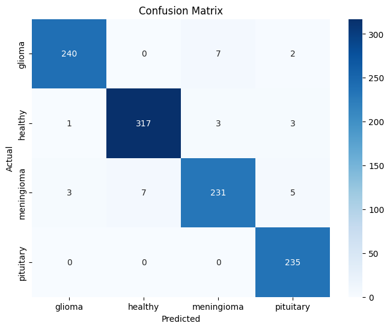
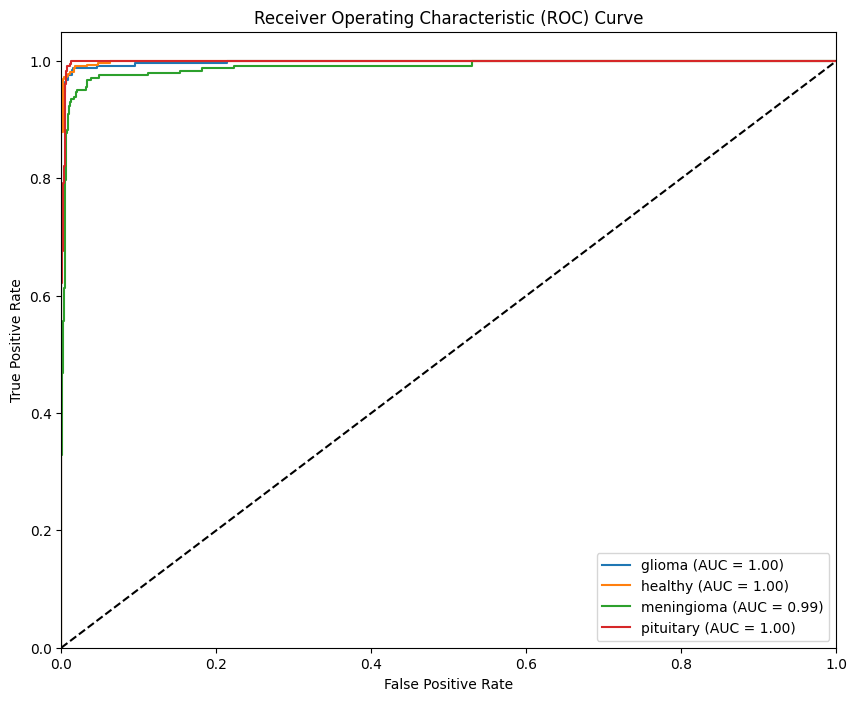
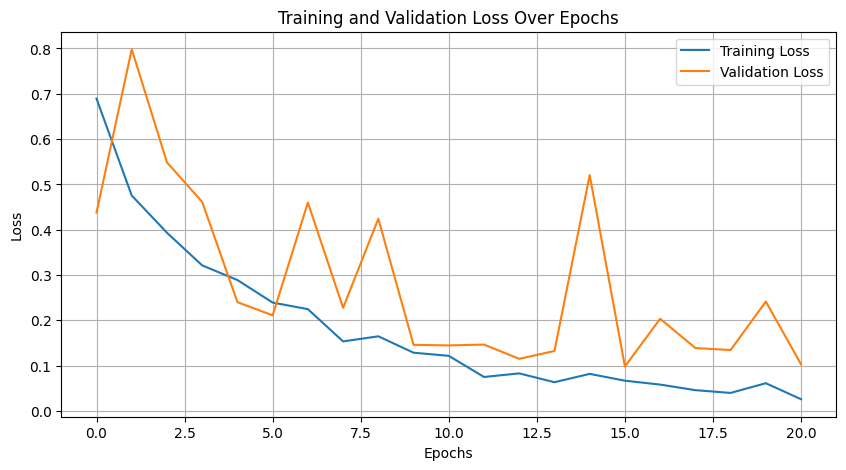
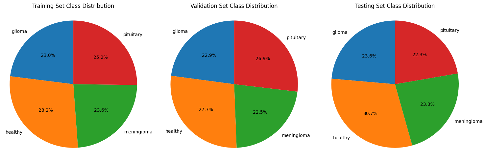

# 🧠 Brain Tumor Detection Based on Deep Learning Approaches and MRI

This project uses deep learning to classify brain MRI images into four categories — **glioma**, **meningioma**, **pituitary**, and **healthy** — using **PyTorch** and **ResNet50**.

---

## 📌 About the Project

- 👨‍💻 **Solo Project** by Sri Sai Ratna Abhishek Kosuri
- 🎓 B.Tech Final Year Project — CSE (AI & ML), VIT-AP University
- 🧠 Built for automated diagnosis of brain tumors from MRI images
- ✅ Works on **any 4-class brain tumor dataset**, not just the one used here
- 📦 Dataset used: [Kaggle - Brain Tumor MRI Scans](https://www.kaggle.com/datasets/rm1000/brain-tumor-mri-scans)

---

## 🛠️ Tech Stack

- **Language**: Python  
- **Frameworks**: PyTorch, Torchvision, Albumentations  
- **Other Libraries**: Matplotlib, Seaborn, Scikit-learn, OpenCV  
- **Platform**: Google Colab  
- **Model**: Pretrained ResNet50 with custom classification head

---

## 🚀 How to Run This Project

1. Go to [https://www.kaggle.com](https://www.kaggle.com) and sign in
2. Go to your **Account Settings** → Download `kaggle.json` API key
3. Upload `kaggle.json` into your Google Colab notebook
4. Run all cells **sequentially**, without skipping
5. The dataset will automatically be downloaded via **Kaggle API**

---

## 📁 Files in the Repo

- `Brain_Tumor_Detection_DL.ipynb` — Main notebook (code + explanation)
- `confusion_matrix.png` — Shows prediction accuracy
- `roc_curve.png` — Multi-class ROC analysis
- `training_validation_loss.png` — Training/validation loss trends
- `class_distribution.png` — Dataset class balance

---

## 📷 Sample Outputs

### 📊 Confusion Matrix


### 🧠 ROC Curve


### 📈 Training vs Validation Loss


### 🗂️ Class Distribution


---

## 🧠 Model Saving

After training, the model is saved in Colab using:

```python
torch.save(model.state_dict(), 'model.pt')
```

---

## ✅ Results

- 📈 Achieved high accuracy on validation and test sets  
- 🔬 Demonstrated feasibility of AI-assisted diagnosis in medical imaging

---

## 📌 Author

**Sri Sai Ratna Abhishek Kosuri**  
B.Tech CSE with AI & ML  
VIT-AP University  

---

## 📝 License

This project is open for educational and portfolio use.

